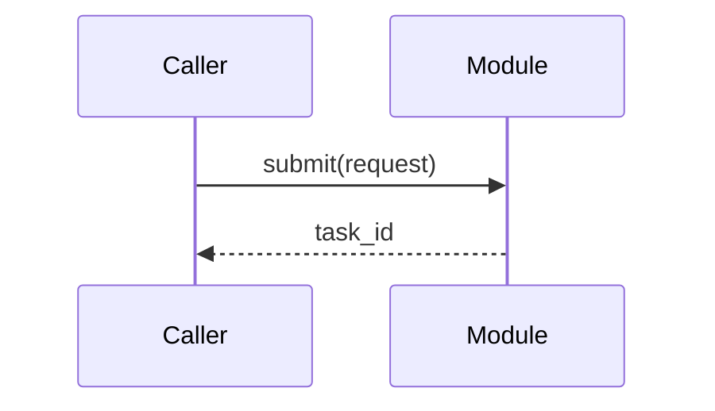

# 示例：模块详细设计摘要

## 1. 模块职责

该模块负责接收请求并将其转换为内部任务。此处为模板示例，不代表任何真实系统实现。

## 2. 接口约定

| 接口 | 输入 | 输出 | 同步语义 |
|---|---|---|---|
| `submit()` | 请求对象 | 任务 ID | 示例：同步返回 |

## 3. 流程

```mermaid
sequenceDiagram
    participant C as Caller
    participant M as Module
    C->>M: submit(request)
    M-->>C: task_id
```
